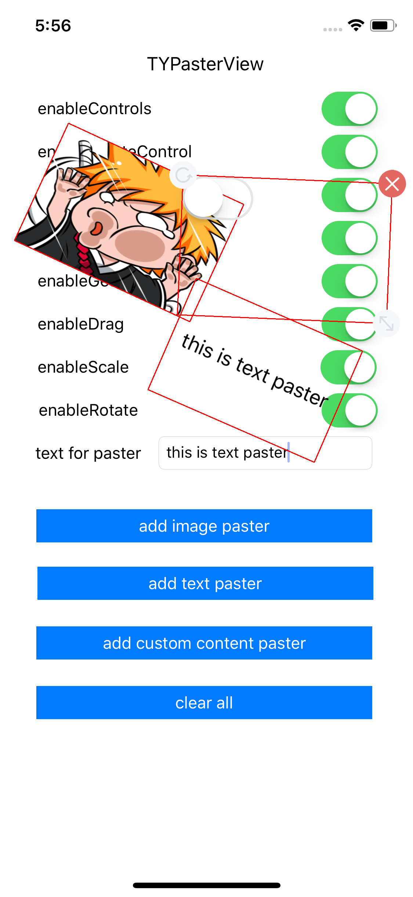

# TYPasterView
这是一个贴纸控件的实现，简单易用。

- 支持拖拽，旋转，缩放手势。
- 支持旋转，缩放，删除按钮。
- 支持图片，文字，自定义view
- 多贴纸控件管理。


## 使用

``` objective-c
// 图片
UIImage *image = [UIImage imageNamed:@"imageName"];
TYPasterView * view1 = [[TYPasterManager sharedInstance] pasterWithImage:image];
view1.frame = (CGRect){CGPointZero,CGSizeMake(150, 100)};
view1.center = CGPointMake(200, 200);
[self.view addSubview:view1];

// 文本
NSString *text = self.pasterLabel.text;
TYPasterView * view2 = [[TYPasterManager sharedInstance] pasterWithText:text];
view2.frame = (CGRect){CGPointZero,CGSizeMake(150, 100)};
view2.center = CGPointMake(200, 200);
[self.view addSubview:view2];

// 自定义view
UISwitch *switchView = [[UISwitch alloc]init];
TYPasterView * view3 = [[TYPasterManager sharedInstance] pasterWithCustomeView:switchView];
view3.frame = (CGRect){CGPointZero,CGSizeMake(150, 100)};
view3.center = CGPointMake(200, 200);
[self.view addSubview:view3];
```


## 效果

<p align="center">
  
</p>

实际效果请运行TYPasterDemo查看。
